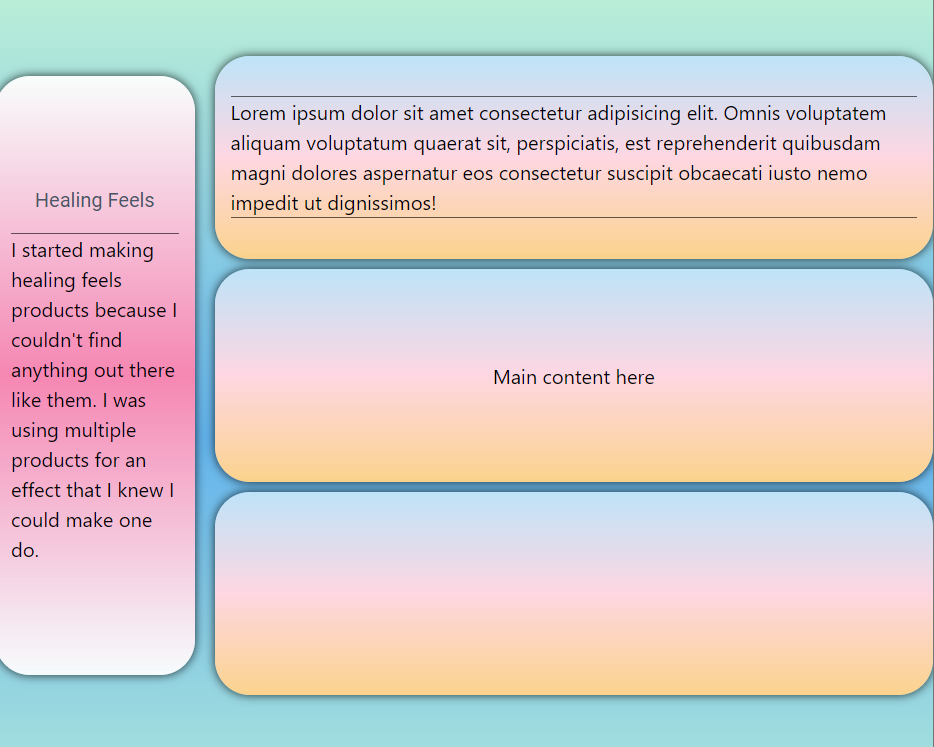

# HealthApp

## Description

HealthApp is a single-page application built using React, Node.js, and Chakra UI. It provides users with various health items to manage their health and wellness.

## Features

- **Feature 1**: Home Page
- **Feature 2**: About Page
- **Feature 3**: Contact Page with a form

## Screenshots

## Installation

To install and run HealthApp locally, follow these steps:

1. Clone the repository: `https://github.com/Palm717/healthApp`
2. Change to the project directory: `cd healthApp`
3. Install dependencies: `npm install`
4. Start the development server: `npm start`

## Usage

1. Open your web browser and visit `http://localhost:3000` to access HealthApp.
2. Provide any necessary login credentials or create a new account.
3. Explore the different sections and features of the application.

## Technologies Used

- React: A JavaScript library for building user interfaces.
- Node.js: A JavaScript runtime environment for server-side development.
- Chakra UI: A simple and customizable component library for building React applications.

## License

This project is licensed under the terms of the MIT license. See the [LICENSE](LICENSE) file for more details.

## Contributing

This project currently does not accept contributions from external contributors.

## Contact

If you have any questions, issues, or suggestions, please feel free to reach out to the project owner:

- Name: Robert
- Email: contact@123.com
